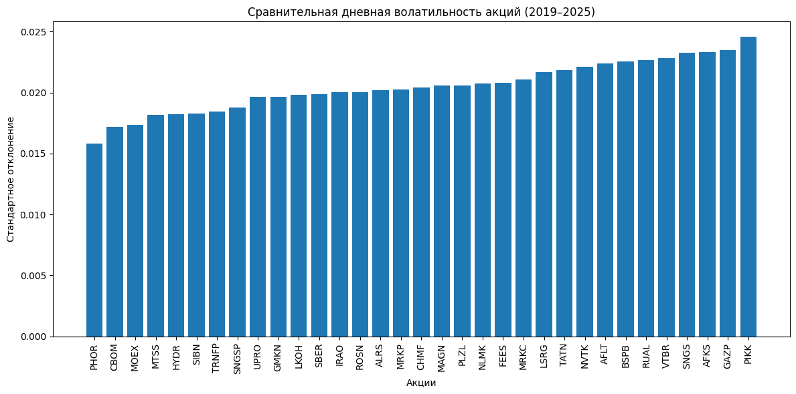
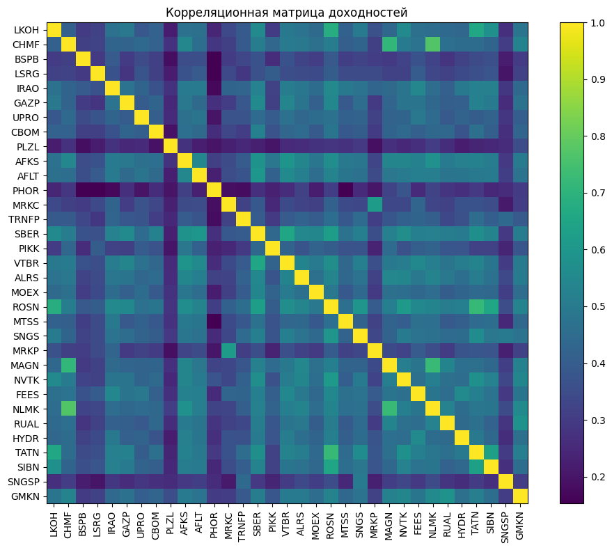
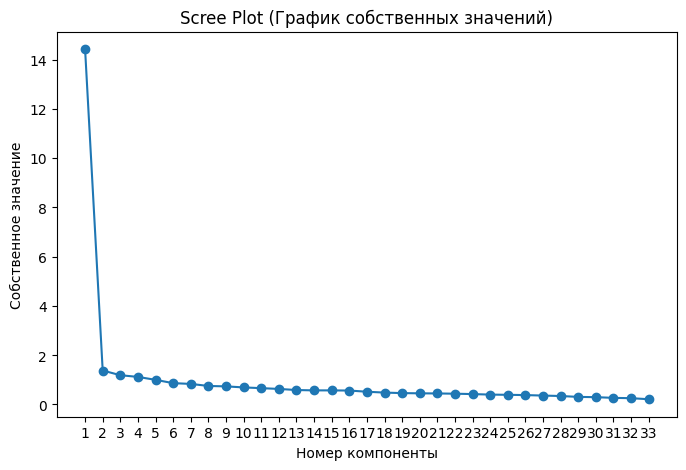
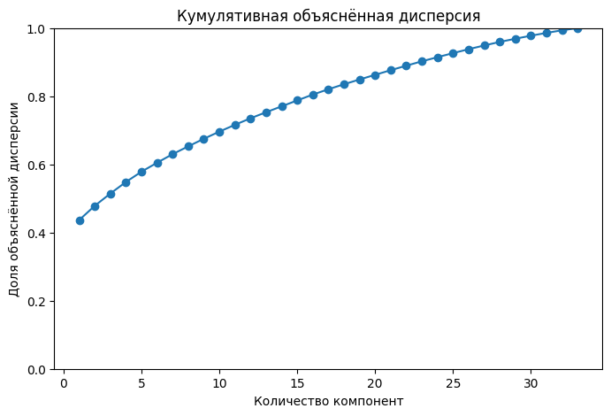
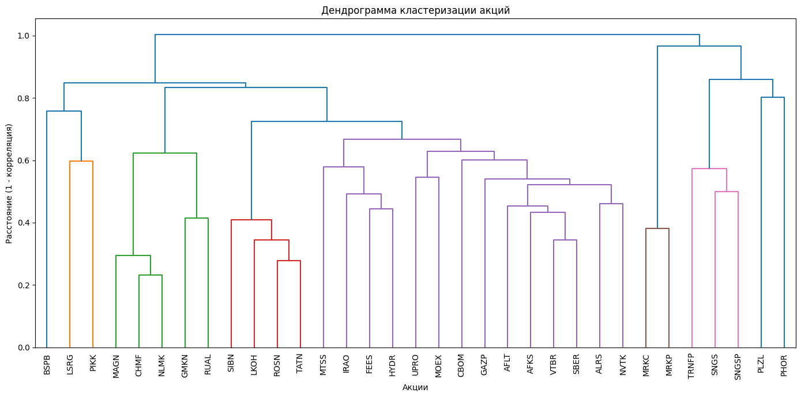

# 📈 Russian Stock Market Factor Analysis


> Statistical analysis of the Russian stock market using Python, Principal Component Analysis (PCA), factor analysis and clustering methods.

## 📖 About the Project
## 📑 Contents

- [Project Overview](#-about-the-project)
- [Objectives](#-objectives)
- [Technologies](#-technologies)
- [Methods](#-methods)
- [Dataset](#-dataset)
- [Repository Structure](#-repository-structure)
- [Author](#-author)
This repository contains the source code and research materials for my bachelor's thesis devoted to the structural and factor analysis of the Russian stock market.

The study is based on daily returns of **33 liquid stocks** traded on the **Moscow Exchange (MOEX)** during the **2019–2025** period. The project applies multivariate statistical methods to identify latent market factors, analyze stock relationships and perform market segmentation.

---

## 🎯 Objectives

- Analyze the structure of the Russian stock market.
- Identify latent market factors using PCA.
- Perform factor analysis of stock returns.
- Cluster stocks based on statistical similarity.
- Visualize and interpret the obtained results.

---

## 🛠 Technologies

- Python
- Pandas
- NumPy
- SciPy
- Scikit-learn
- Matplotlib
- Jupyter Notebook

---

## 📊 Methods
---

## 📌 Key Results

## 📌 Key Results

The statistical analysis revealed several important characteristics of the Russian stock market:

- The dataset includes **33** highly liquid stocks traded on the Moscow Exchange (MOEX) over the **2019–2025** period.
- Principal Component Analysis (PCA) showed that the **first principal component explains approximately 43.7% of the total variance**, indicating the presence of a strong common market factor.
- Correlation analysis demonstrated moderate to high relationships between many stocks, reflecting the influence of systematic market movements.
- Hierarchical clustering identified stable groups of companies with similar return dynamics, largely corresponding to sectoral characteristics.
- The explained variance analysis confirmed that only a few principal components capture a significant share of the market information.
- The obtained results can be applied to portfolio construction, market segmentation and investment risk assessment.


---

## 📈 Dataset

| Parameter | Value |
|-----------|------:|
| Exchange | Moscow Exchange (MOEX) |
| Stocks | 33 |
| Observation Period | 2019–2025 |
| Trading Days | 1710 |
| Frequency | Daily |
| Data Type | Stock Returns |

---

# 📊 Visualizations

The following figures present the main results of the statistical analysis.

## Average Market Return



---

## Correlation Matrix



---

## Scree Plot (Eigenvalues)



---

## Explained Variance



---

## Hierarchical Clustering (Dendrogram)



---
---

## 📂 Repository Structure

```text
src/          Python source code
notebooks/    Jupyter notebooks
figures/      Charts and visualizations
data/         Input data
thesis/       Final thesis
```
---

## 💻 Source Code

The complete implementation of the statistical analysis is available in the Google Colab:

📄 **`диплом (2).ipynb`**

The notebook contains the complete workflow of the project, including:

- data preprocessing;
- descriptive statistical analysis;
- correlation analysis;
- Principal Component Analysis (PCA);
- factor analysis;
- hierarchical clustering;
- K-Means clustering;
- data visualization;
- interpretation of the obtained results.

---


## 👤 Author


**Ilya Pervojkin**

Bachelor Thesis, 2026
---
## 📬 Contact

If you have any questions or suggestions regarding this project, feel free to open an Issue or contact me via GitHub.

---

⭐ If you found this project interesting, consider giving it a star.
